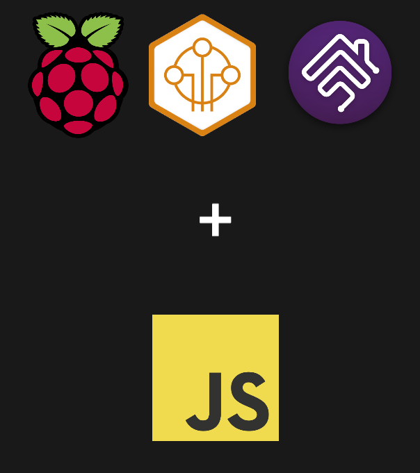

<h1 align="center">JavaScript in IoT - TechTalk</h1>

    
     
    <i>Created by <b>Jakub Jóźwiak</b></i>

    Live presentation:
    <a href="https://js-in-iot.netlify.app/"><strong>js-in-iot.netlify.app</strong></a>

